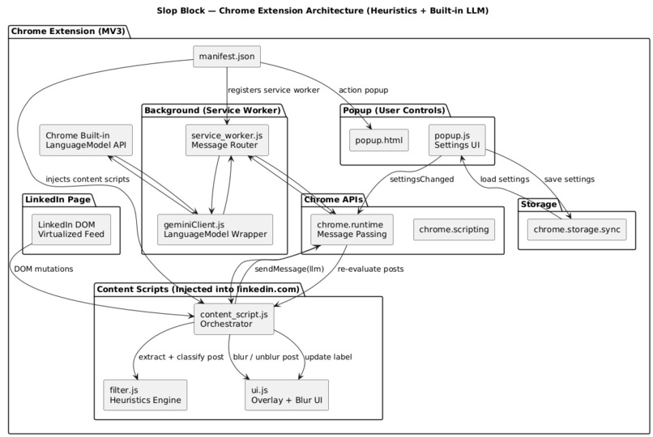
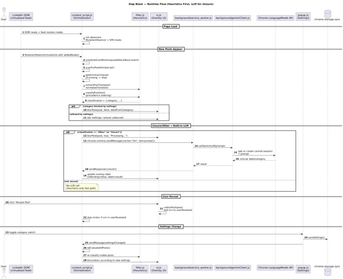

# Slop Block

Filter your LinkedIn feed to show only recruiter hiring posts. Clean your feed from noise and focus on what matters.

## About

Slop Block is a Chrome extension that uses a hybrid classification system (local heuristics + AI) to filter LinkedIn posts. It automatically hides job announcements, grindset posts, engagement bait, and other noise while keeping genuine recruiter hiring posts visible.

**Key Philosophy**: Slop Block uses deterministic heuristics as the primary filter and only invokes Chrome's built-in LLM as a fallback for ambiguous posts, preserving performance, privacy, and control.

## Features

- **Heuristics First**: Fast keyword and phrase matching runs first for instant results
- **AI Fallback**: Chrome's built-in LanguageModel API (Gemini Nano) only processes uncertain cases
- **Privacy First**: All processing happens locally. No data sent to external servers
- **Customizable**: Toggle 13+ post categories on/off via the popup interface
- **Real-time Updates**: Automatically processes new posts as they appear using MutationObserver
- **Performance Optimized**: Batched processing with requestIdleCallback, no layout shifts, no scroll jank
- **SPA Navigation Support**: Automatically re-initializes on LinkedIn's single-page app navigation

## Installation

### Prerequisites

- **Chrome Canary or Beta version 127+** (required for LanguageModel API support)
- Google Chrome browser

### Step 1: Enable Chrome's Built-in AI (Required)

Slop Block requires Chrome's built-in LanguageModel API powered by Google Gemini Nano for AI classification. To enable this feature:

1. Ensure you're using **Chrome Canary or Beta version 127+**
2. Navigate to `chrome://flags` in your address bar
3. Enable these flags:
   - `#prompt-api-for-gemini-nano`
   - `#optimization-guide-on-device-model`
4. Restart Chrome

For detailed setup instructions and system requirements, see the [official Google Chrome AI documentation](https://developer.chrome.com/docs/ai/get-started).

**Note**: The first post you load may take longer to process as Chrome needs to initialize and download the Gemini Nano model. Subsequent posts will process much faster once the model is loaded.

### Step 2: Download the Extension

1. Go to the [Slop Block repository](https://github.com/OmarCodes2/Slop-Block)
2. Click the green **"Code"** button
3. Select **"Download ZIP"**
4. Extract the downloaded ZIP file to a location you can easily access

### Step 3: Load the Extension in Chrome

1. Open Google Chrome
2. Navigate to `chrome://extensions/` in the address bar
   - Alternatively: Go to **Menu (⋮)** → **Extensions** → **Manage Extensions**
3. Toggle the **"Developer mode"** switch in the top-right corner
4. Click the **"Load unpacked"** button
5. Navigate to and select the `chrome extension` folder inside the extracted directory
   - **Important**: Select the `chrome extension` folder, not the root `Slop-Block` folder

### Step 4: Start Using Slop Block

That's it! Visit your LinkedIn feed and Slop Block will automatically start filtering posts. You can customize which post categories to show/hide by clicking the extension icon in your Chrome toolbar.

## Architecture

The extension follows a clean separation of concerns with clear boundaries between components:



### Component Overview

**Manifest.json** - Entry point that registers:
- Background service worker
- Content scripts injected into LinkedIn
- Popup UI for user controls

**Content Scripts** (LinkedIn page) - Handle the heavy lifting:
- `content_script.js` - Orchestrator that observes DOM mutations, identifies posts via URNs, and coordinates classification and blocking
- `filter.js` - Pure heuristics engine (fast, local, deterministic) with precedence-ordered classification rules
- `ui.js` - Handles blur overlays, labels, and user reveal actions

**Background Service Worker** - Only place where AI runs:
- `service_worker.js` - Routes messages from content scripts
- `geminiClient.js` - Wraps Chrome's built-in LanguageModel API, caching a single session

**Popup + Storage** - Manage user preferences:
- `popup.js` - Saves settings to `chrome.storage.sync`
- Content scripts re-evaluate visible posts when settings change

### Why This Architecture Matters

- **Fast by default**: Heuristics run first, AI is only a fallback
- **Expensive AI calls minimized**: Most posts never touch AI
- **Clear isolation**: Separation between DOM access, AI access, and user controls
- **Scales well**: Works efficiently with LinkedIn's virtualized feed

## Runtime Flow

The extension processes posts in a heuristics-first approach:



### Processing Flow

1. **Page Load**
   - LinkedIn renders its virtualized feed
   - `content_script.js` initializes MutationObserver and SPA navigation hooks

2. **New Posts Appear**
   - DOM mutations trigger a scheduled scan (batched with `requestIdleCallback`)
   - Each post is assigned a stable URN (Uniform Resource Name)
   - Post text is extracted and normalized

3. **Heuristics Classification (Fast Path)**
   - `filter.js` classifies the post using precedence-ordered rules
   - If the category is blocked by settings → blur immediately
   - If allowed → leave unblurred
   - **No AI involved** for the majority of posts

4. **LLM Fallback (Slow Path, Only If Needed)**
   - If heuristics return "Other / Unsure":
     - UI shows "Processing…"
     - Content script sends a message to the background worker
     - The Gemini client reuses a cached LanguageModel session
     - Returns a short label/category
     - UI updates the overlay label
   - If not unsure → LLM is never called

5. **User Reveal**
   - Clicking "Reveal Post" unblurs the post
   - The URN is added to `userRevealed` so it won't be re-blocked

6. **Settings Change**
   - User toggles a filter in the popup
   - Settings are saved to sync storage
   - Content script re-classifies all visible posts and updates blur state

### Why This Flow Matters

- **Critical path is local and synchronous**: Heuristics provide instant results
- **AI calls are asynchronous, rare, and clearly isolated**: Only for ambiguous cases
- **Feed stays smooth**: Even under heavy scrolling, processing is batched and non-blocking
- **User intent always wins**: Manual reveals are respected and persisted

## Project Structure

```
Slop-Block/
├── architecture.jpg          # Architecture diagram
├── sequence.jpg              # Runtime flow diagram
├── chrome extension/         # Chrome extension source code
│   ├── background/         # Background service worker
│   │   ├── service_worker.js    # Message routing
│   │   └── geminiClient.js     # LanguageModel API wrapper
│   ├── content/             # Content scripts
│   │   ├── content_script.js   # Main orchestrator
│   │   ├── filter.js           # Heuristics classification
│   │   ├── ui.js               # UI overlay management
│   │   └── styles.css          # Overlay styles
│   ├── popup/               # Extension popup UI
│   │   ├── popup.html
│   │   ├── popup.js
│   │   └── popup.css
│   ├── icons/               # Extension icons
│   └── manifest.json        # Extension manifest
└── docs/                    # Website documentation
    ├── index.html
    ├── styles.css
    └── script.js
```

## How It Works

### Classification Categories

Slop Block identifies and filters 13+ categories of LinkedIn posts:

1. **Hiring Posts** (default: shown) - Recruiter posts actively seeking candidates
2. **Job Announcements** (default: hidden) - Posts announcing new positions
3. **LinkedIn Grindset Final Boss** (default: hidden) - Extreme hustle culture posts
4. **AI Doomer** (default: hidden) - Posts claiming AI will replace all developers
5. **Child Prodigy Flex** (default: hidden) - Posts emphasizing extreme youth + achievement
6. **Sponsored/Ads** (default: hidden) - Promoted and sponsored posts
7. **Sales Pitch** (default: hidden) - Sales and lead generation posts
8. **Job Seeking** (default: hidden) - Open-to-work and layoff posts
9. **Events/Webinars** (default: hidden) - Event and webinar announcements
10. **Engagement Bait** (default: hidden) - Comment traps and engagement farming
11. **Educational/Tips** (default: hidden) - Educational content and tips
12. **Project Launch** (default: hidden) - Project launches and shipping posts
13. **Congrats/Certs** (default: hidden) - Congratulations and certification posts
14. **Other** (default: hidden) - Posts that don't match other categories (AI-classified)

### Heuristics Classification

The heuristics engine uses:
- **Phrase matching**: Extensive lists of keywords and phrases for each category
- **Regex patterns**: High-signal patterns for structured variants
- **Precedence ordering**: Categories are checked in a specific order (e.g., hired announcements before hiring posts)
- **Text normalization**: Handles curly quotes, dashes, and punctuation variations

### AI Classification

When heuristics can't confidently classify a post:
- Post is marked as "Other / Unsure"
- Background worker is notified via message passing
- Chrome's built-in LanguageModel API (Gemini Nano) processes the post text
- Returns a 1-3 word category label
- UI updates to show the AI-determined category

## Performance Optimizations

- **URN-based deduplication**: Posts are tracked by stable URNs to prevent re-processing
- **Batched processing**: Multiple posts are processed together using `requestIdleCallback`
- **Subtree-only scanning**: Only newly added DOM nodes are scanned, not the entire feed
- **Virtualization-safe**: Works correctly with LinkedIn's virtualized feed implementation
- **Session caching**: LanguageModel session is cached and reused across requests

## License

[Specify your license here]

## Contributing

Contributions are welcome! Please feel free to submit a Pull Request.

## Links

- [GitHub Repository](https://github.com/OmarCodes2/Slop-Block)
- [Website/Documentation](https://[your-domain].com) <!-- Update with your actual domain -->
